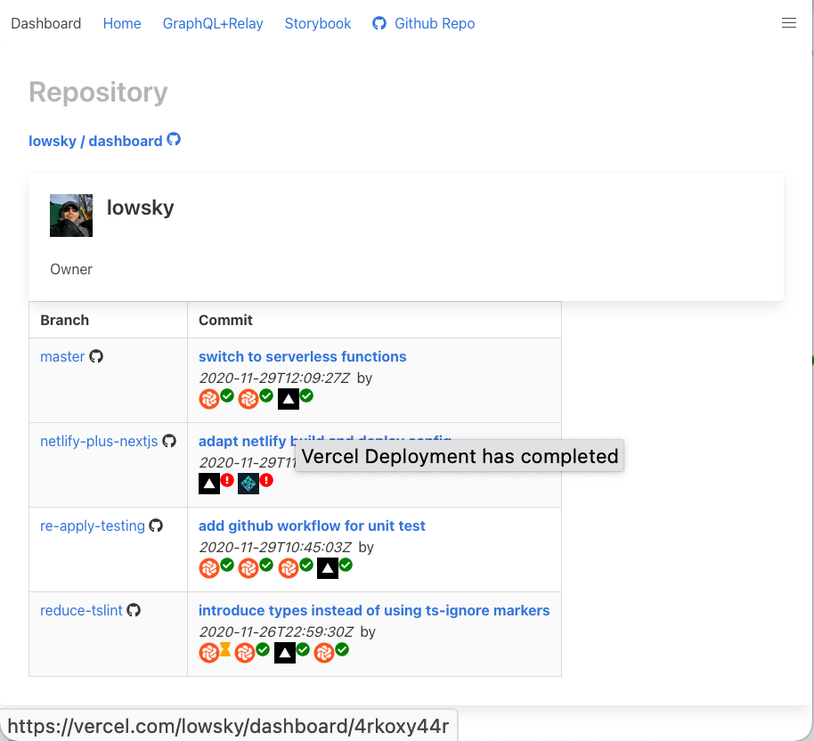

[](https://snyk.io/test/github/lowsky/dashboard)   
[](https://app.netlify.com/sites/github-dashboard/deploys)

## Purpose

This web app lists the `(feature) branches` of a github repository with its

-   last commit's build status
-   last commit's commit message
-   links to running running docker containers for each feature (upcoming feature)

The idea behind this was, to get an easy access to all feature branches for demoing new features before going live.

Presentation on a Meetup: You can find the [slides here](https://github.com/lowsky/dockerMeetupSlides)

## Getting started

After invoking this in a shell

    git clone https://github.com/lowsky/dashboard
    cd dashboard
    
    # Install the dependencies of the react app and
    # installs the server's dependencies, too:
    yarn 
    
then setup the `github-token` (see [Setup Github Token](#setupgithubtoken) ) before starting via:

    yarn dev
    
for a simple `dev mode`: it starts the serverless-based serverless functions and the web app in parallel.

Open [http://localhost:3000](http://localhost:3000) with your browser to see the result.

### Built-in GraphQL-backend

It also provides a GraphIql Playground at <http://localhost:3000/api/graphql> - which is great 
(Note: you may need to specify this endpoint http://localhost:3000/.netlify/functions/graphql , too)
for using and playing with different graphql queries, e.g.:
```graphql
{
  github {
    user(username: "lowsky") {
      login
      avatar_url
    }
    repo(ownerUsername: "lowsky", name: "dashboard") {
      name
      branches{name}
    }
  }
}
```

Have fun!

**Note:**
### setupGithubToken
You  **need to create your own github-token** (see https://github.com/settings/tokens/) and 
store it locally in `.env` file (similar to [server/.env.example](server/.env.example) )

    # create your own .env file as a copy of .env.example by
    cp .env.example .env
    
    # ... and replace the XXX with your API key

## ScreenShot



# Background

This project was used to figure out and to demonstrate, how to develop a frontend UI with Facebook's _Relay_ and _GraphQL_ libraries.

For deep interns of GraphQL concepts, see the [presentation at the EnterJS Conference 2016](https://lowsky.github.io/deck-graphql-relay-talk) with its [slide sources](https://www.github.com/lowsky/deck-graphql-relay-talk)

## License

Licensed under the Apache License 2.0, Copyright ©️ 2018 Robert Hostlowsky. See [LICENSE](LICENSE) for more information.


