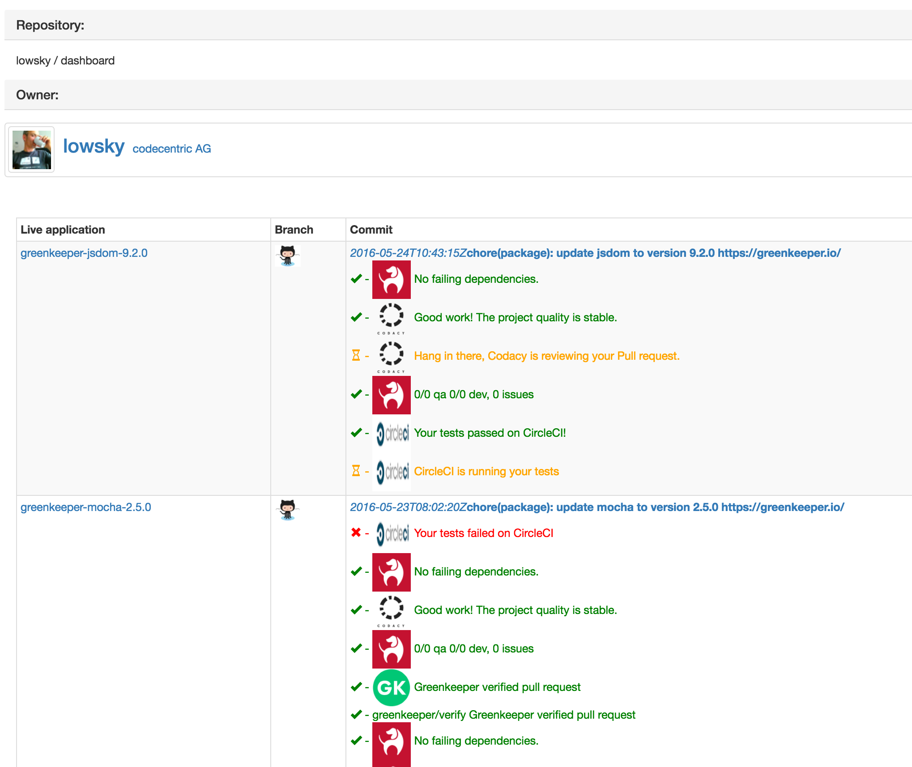

  

 

 

This project was used to figure out and to demonstrate, how to develop a frontend UI with Facebook's _Relay_ and _GraphQL_ libraries.

For deep interns of the concepts, see the [presentation at the EnterJS Conference](https://lowsky.github.io/deck-graphql-relay-talk) with its [slide sources](https://www.github.com/lowsky/deck-graphql-relay-talk)

## Purpose of this dashboard

This web app lists the (feature) branches of a specific github repository,

-   shows the last commit's build status
-   shows the last commit's commit message
-   links to running running docker containers for each feature (not implemented yet)

On a Docker Meetup, I presented some details about the background idea: You can find the [slides here](https://github.com/lowsky/dockerMeetupSlides)

## Getting started locally

A reduced functionality with a RESTful api backend works out of the box,
after invoking this in a shell:

    git clone https://github.com/lowsky/dashboard
    cd dashboard
    npm install  # or  yarn

### regular mode for deployment

    npm start   # or   yarn run start

**Note:**
You  **need to create your own github-token** and store it locally:

    # create your .env file as a copy of .env.example by
    cp .env.example .env
    # ... and adapt it with your API key:
    # You can create one at
    # https://github.com/settings/tokens/

### Run dev-mode: with HOT re-loading

Note: For Relay you also need to start in _regular mode_, to activate the graphql-server.

    npm run dev  # this opens the browser automatically

For local development this also uses webpack-dev based hot-reloading which automatically updates the page in the browser!

### Built-in GraphQL-backend

It also provides a GraphIql IDE at <http://localhost:3000/graphql> - This is the ideal _playground_ 
for using and playing with different graphql queries.

Have fun!

## ScreenShot

